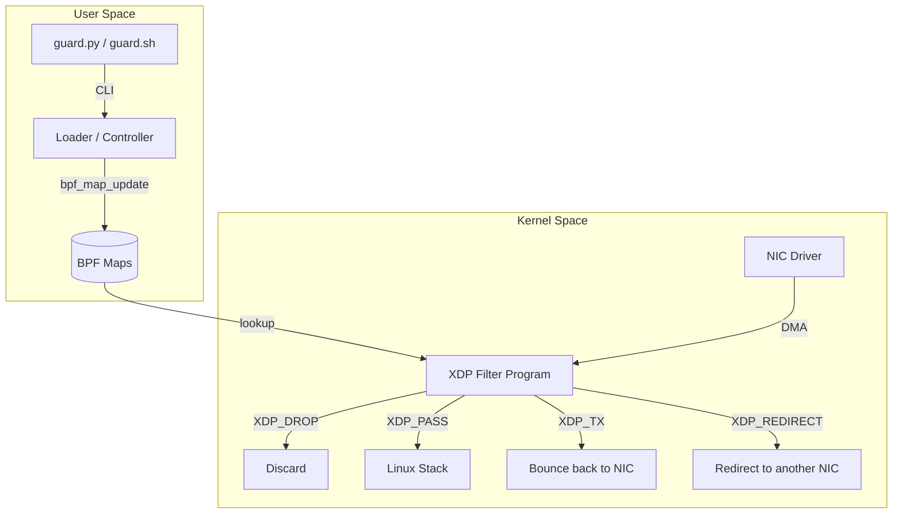

# Architecture Overview

XDP-L2-Guard follows a decoupled architecture, separating the high-performance data plane (Kernel Space) from the management and configuration logic (User Space).

## System Components

## Data Plane (eBPF/XDP)

The data plane is implemented in C and compiled into eBPF bytecode. It hooks into the network driver's NAPI loop using XDP (eXpress Data Path).

### Key Features:
- **Direct Access**: Operates on `xdp_md` context, providing direct access to packet data.
- **Stateless**: The filter is primarily stateless, relying on BPF maps for rule lookup.
- **Performance**: Bypasses `sk_buff` allocation, leading to significant performance gains under high traffic.

### Hook Points:
- `SEC("xdp")`: The main entry point `xdp_drop_logic`.

## Control Plane (Python/Bash)

The control plane manages the lifecycle of the eBPF program and provides a user-friendly interface for rule management.

### Components:
- **Loader (`src/control_plane/loader.py`)**: Loads the eBPF object file into the kernel and attaches it to the specified interface. It also populates the initial maps.
- **CLI (`src/control_plane/guard.py`)**: An `iptables`-like interface to interact with the `action_map`.
- **Bash Wrapper (`scripts/guard.sh`)**: A lightweight version using `bpftool` for environments where Python might not be preferred.

## BPF Maps

Maps are the bridge between User Space and Kernel Space.

1. **`action_map` (Hash Map)**:
   - **Key**: Destination IP (`__u32`).
   - **Value**: `struct action_cfg` containing:
     - `target`: Action to perform (DROP, PASS, TX, REDIRECT, NAT).
     - `new_ip`: Destination IP for NAT.
     - `ifindex`: Target interface index for REDIRECT.
     - `dropped_packets`: Counter for monitoring.

2. **`dev_map` (Device Map)**:
   - Used for `XDP_REDIRECT` to efficiently forward packets to other interfaces.

3. **`total_dropped` (Array Map)**:
   - A single-element array to track total dropped packets across all rules.

## Packet Flow Logic

1. Packet arrives at the NIC.
2. XDP program is triggered before `sk_buff` is created.
3. Program parses Ethernet and IP headers.
4. Program lookups the Destination IP in `action_map`.
5. If a match is found, the specified action is performed.
6. If no match, `XDP_PASS` is returned, letting the packet continue to the Linux network stack.
